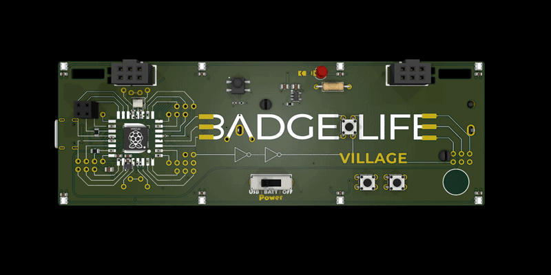

# Badgelife Village Badge Example Firmware



A small, (maybe overly) commented example sketch for the
[Badgelife Village Badge](https://badge.life/badges/dc34/villagebadge/)
(DC34, 2026). It is meant to be a starting point, where you can
compile, flash, and start editing to build your own badge firmware
for the badge!

It demonstrates:

- The 8 RGB LEDs, running a rainbow animation
- The vibration motor, buzzing at boot and then once every 5 seconds
- The battery voltage sense circuit, printed to the serial monitor
- Two capacitive touchpads, each lighting up a different LED while held
- An infrared receiver, printing any remote control code it hears
- Three tactile buttons, printing press, double-press, and long-press
  events, with a short buzz on every tap

The code is organized as one file per piece of hardware:

| File | What it does |
|---|---|
| `BadgeStub/pins.h` | Every GPIO pin number used, in one place |
| `BadgeStub/BadgeStub.ino` | `setup()` / `loop()`, and the LED/Button code |
| `BadgeStub/vibration.h/.cpp` | Vibration motor driver |
| `BadgeStub/battery.h/.cpp` | Battery voltage reading |
| `BadgeStub/touch.h/.cpp` | Capacitive touchpad reading |

Read them in that order if you are new to the codebase.  Each file has
comments explaining not just what the code does, but why it is written
that way.

## Hardware this expects

- The Badgelife Village Badge (an RP2354 microcontroller with 2MB of
  onboard flash; see the flash size note in `platformio.ini` if you are
  targeting a different RP2350/RP2354 board)
- 8 WS2812b/NeoPixel style RGB LEDs on one data pin
- A DC vibration motor driven by a digital output pin
- A battery voltage divider gated by a digital output pin, feeding an ADC
  input pin
- Two capacitive touch pads, each wired to a charge pin and a detect pin
- An infrared receiver module (the demodulating 3-pin kind) on a digital
  input pin
- Three tactile push buttons, each wired active-LOW to a digital input pin
- Two Simple Add-On (SAO) v2 headers, each exposing an I2C bus (mapped in
  `pins.h` for reference; not used by this code)

All of the pin numbers are collected in `BadgeStub/pins.h`. If your wiring
is different, that is the only file you need to change.

## Building with PlatformIO

This folder is already set up as a PlatformIO project.

1. Install [PlatformIO](https://platformio.org/) (the VS Code extension,
   or the `pio` command line tool).
2. Open a terminal in this `StarterFirmware` folder.
3. Compile:
   ```
   pio run
   ```
4. Plug in the badge and flash it:
   ```
   pio run --target upload
   ```
5. Watch the serial output (battery voltage, IR codes):
   ```
   pio device monitor
   ```

## Building with the Arduino IDE

The same source files also work as a plain Arduino sketch - no changes
needed.

1. Install the [Arduino IDE](https://www.arduino.cc/en/software) (2.x
   recommended).
2. Add the RP2040/RP2350 board support ("Earle F. Philhower, III" core):
   - Open File > Preferences, and add this URL to "Additional Boards
     Manager URLs":
     ```
     https://github.com/earlephilhower/arduino-pico/releases/download/global/package_rp2040_index.json
     ```
   - Open Tools > Board > Boards Manager, search for "pico", and install
     "Raspberry Pi Pico/RP2040/RP2350" by Earle F. Philhower, III.
3. Install the "Adafruit NeoPixel", "IRremote", and "ButtonFever"
   libraries via Tools > Manage Libraries. When searching for "IRremote",
   pick the one maintained by Armin Joachimsmeyer (the "Arduino-IRremote"
   project) - there are several old, unmaintained libraries with the same
   name.
4. Open `BadgeStub/BadgeStub.ino` directly
   (Arduino opens sketches by their `.ino` file, and the sketch folder name
   must match the `.ino` file name, which is why the source lives in a
   `BadgeStub` subfolder here).
5. Under Tools > Board, pick the RP2350 board that matches your hardware
   (for example "Raspberry Pi Pico 2", or "Generic RP2350" if you need to
   set the flash size by hand).
6. Under Tools, set the flash size to match your board if you picked
   "Generic RP2350".
7. Click Upload.

Both tools compile the exact same files, so choose whichever you like more.
Note: PIO is way faster at compiling

## How each piece of hardware works

### LEDs (rainbow animation)

The badge uses the
[Adafruit_NeoPixel](https://github.com/adafruit/Adafruit_NeoPixel) library.
`BadgeStub.ino` creates a `Adafruit_NeoPixel strip` object at the top of the
file, and every frame in `loop()` calls `strip.rainbow(firstHue)` followed
by `strip.show()`.`rainbow()` is a built-in helper that fills the whole strip
with one cycle of the color wheel; changing `firstHue` a little every frame
is what makes it slide across the strip over time.

To draw your own pattern instead, call `strip.setPixelColor(index, color)`
for each pixel you want to change, then `strip.show()` to push it out -
nothing changes on the physical LEDs until `show()` is called.

### Vibration motor

The motor is a plain DC vibration motor driven by a digital output pin.
There is no speed or tone control: `HIGH` spins it, `LOW` stops it.

`vibration.cpp` runs the motor for a set duration without blocking the
rest of the program with `delay()`. `Vibration_Pulse(durationMs)` turns
the motor on and remembers when it should turn back off; `Vibration_Pump()`
must be called every `loop()` so it can notice when that time has passed
and switch the pin back to `LOW`.

### Battery voltage

The RP2350's ADC can only read voltages between 0 and 3.3V, but a charged
battery can be well over that. A resistor divider (two equal resistors)
cuts the battery voltage exactly in half before it reaches the ADC pin, so
the real voltage is recovered by reading the ADC and doubling the result.

That divider would slowly drain the battery if left connected all the
time, so a transistor switch gates it on only while a reading is being
taken: `battery.cpp` turns the divider on, waits a few milliseconds for the
voltage to settle, averages a few ADC readings, then turns the divider back
off. `Battery_Pump()` repeats this every few seconds, since a battery's
voltage does not change quickly enough to need checking on every single
`loop()` call.

### Touchpads

Each touchpad is read by timing how long it takes to charge up, not by
reading an analog "touch strength" value directly. A "charge" pin pushes
current into the pad through a resistor, and a "detect" pin on the far
side watches for the pad to reach a logic HIGH. A finger touching the pad
adds capacitance, which measurably slows that charge-up time down.

`touch.cpp` counts loop iterations while waiting for the detect pin to go
HIGH - a bigger count means it took longer, which means more capacitance
(a touch) is on the pad. At startup, `Touch_Init()` takes several readings
with nothing touching the pads to establish a baseline count for each one.
Every reading after that is compared against its own pad's baseline: a
touch is reported once a reading climbs far enough above that baseline. A
couple of consecutive readings are required to agree before the touched/
released state actually changes, which keeps ordinary electrical noise
from being mistaken for a touch.

### Infrared receiver

The IR receiver module outputs an active-LOW digital signal: LOW while it
sees 38kHz infrared light, HIGH otherwise. Remote controls (and other
microcontrollers with an IR transmitter) encode data by varying how long
those LOW and HIGH pulses last. Timing those pulses accurately enough to
decode a signal is fiddly to get right by hand, so this sketch uses the
[IRremote](https://github.com/Arduino-IRremote/Arduino-IRremote) library
instead of a custom decoder. It is the standard choice for IR receiving
on Arduino, supports a long list of remote control protocols (including
the OpenLASIR protocol the main firmware reacts to).

- `IrReceiver.begin(PIN_IR_RECEIVER, 0)` in `setup()` starts listening on
  the receiver pin (the `0` means no feedback LED is wired up).
- `IrReceiver.decode()` in `loop()` returns `true` once a full signal has
  arrived and been decoded.
- `IrReceiver.decodedIRData.command` then holds the decoded command byte,
  and `IrReceiver.resume()` clears it and starts listening for the next
  signal.

See the library's examples for reading the sender's address, the specific
protocol used, and other data.

### Buttons

The three tactile buttons are read using the
[ButtonFever](https://github.com/mickey9801/ButtonFever) library, which
handles debouncing and can tell a single press apart from a double press
or a press-and-hold, instead of you having to write that timing logic and
debouncing by hand.

Each button gets its own `BfButton` object, created as
`BfButton::STANDALONE_DIGITAL` (a plain digital button, as opposed to
several buttons sharing one analog pin, which the library also supports).
In `setup()`, `onPress()`, `onDoublePress()`, and `onPressFor()` attach a
callback function to each press pattern - this sketch uses one shared
callback, `OnButtonPress()`, for all three buttons and all three patterns,
and tells them apart by comparing the `btn` pointer the library passes
in against `&btnLeft`, `&btnRight`, and `&btnA`.

`btnLeft.read()`, `btnRight.read()`, and `btnA.read()` must be called
every `loop()` - that is what actually checks the pin and runs the timing
logic that decides whether a press was a single tap, a double tap, or a
hold, and calls your callback once it knows.

## Have fun!
With that, I hope to see some cool code and firmware made for this device.
Have fun and happy hacking!

-Jeff "BigTaro"

## License
This firmware is provided as a starting point for hacking on the Badgelife Village badge hardware. Use it however you like!
